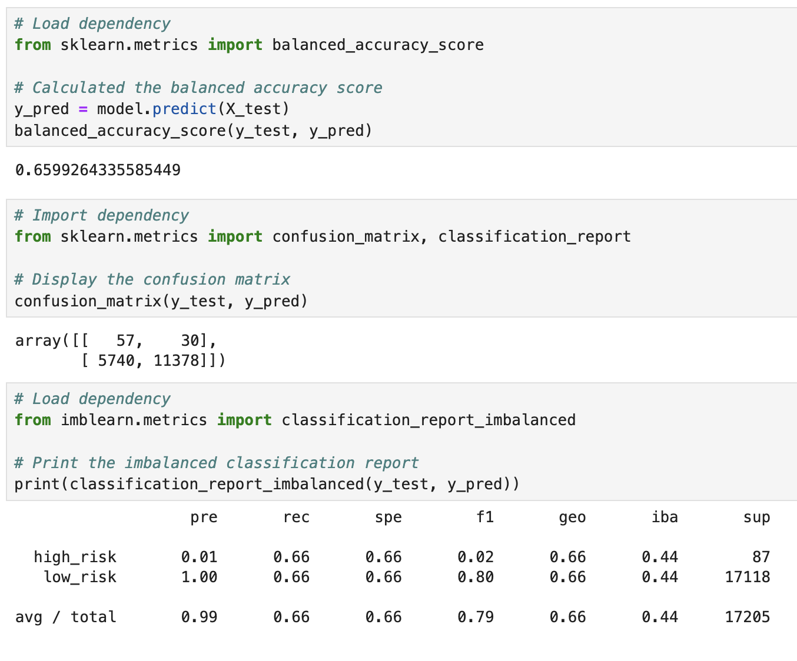
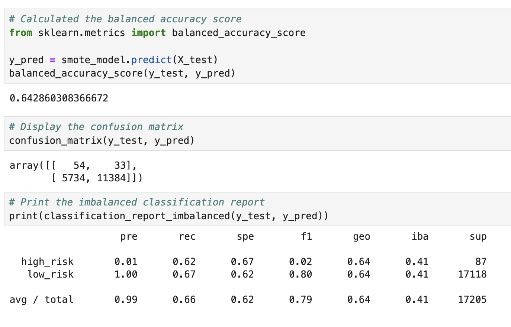
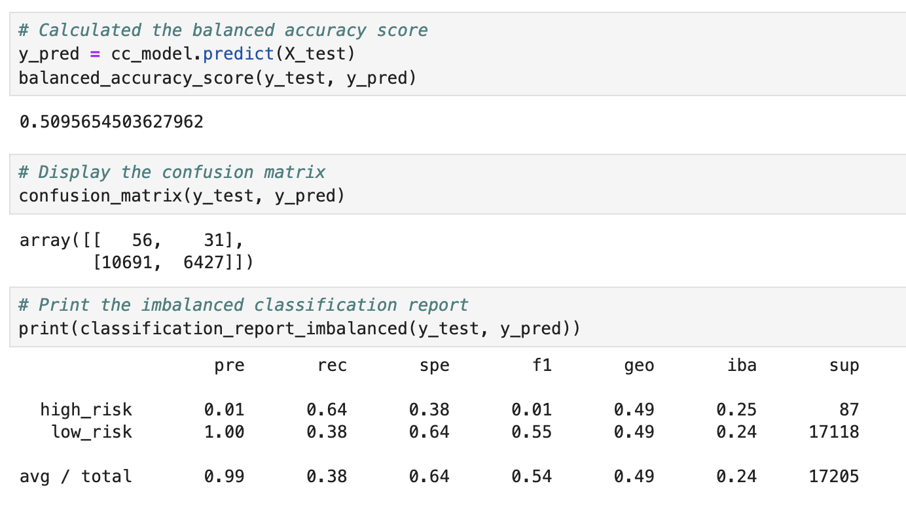
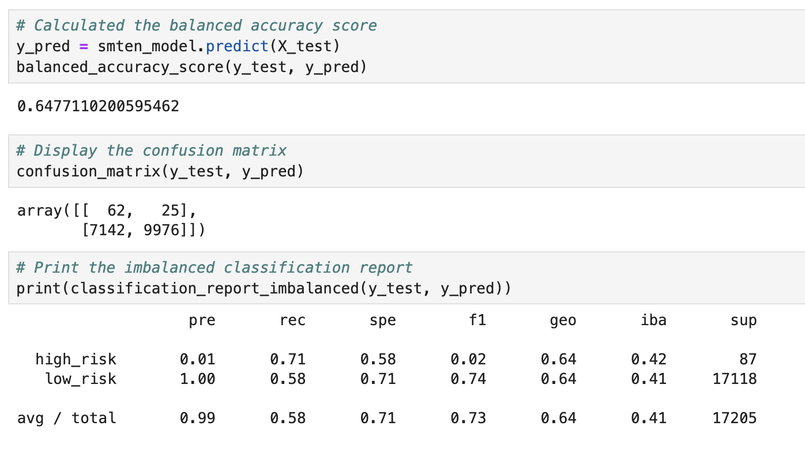
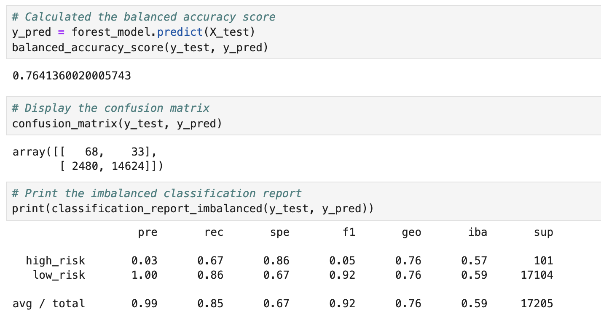
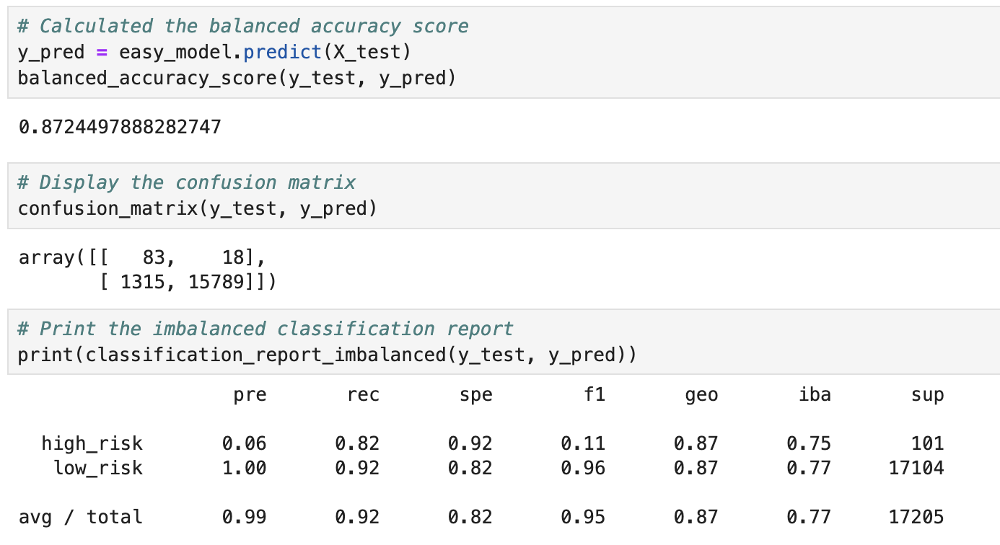

# Overview 
The purpose of this analysis is to evaluate the performance of three sampling algorithims in predicting credit risk. 

### Tasks
- use RandomOverSampler and SMOTE algorithms to oversample credit card data
- Use ClusterCentroids algorithm to undersample credit data
- Use SMOTEENN algorithim to over and under sample
- Compare BalancedRandomForestClassifier and EasyEnsembleClassifier to identify the best model for credit risk perdiction
  
### Data
Credit card dataset was taken from LendingClub, a peer-to-peer lending services company.

## Results
Notes: instances mean loans

### Naive Random Oversampling

The model's balanced accuracy score was 0.6599. Precision for high-risk is 0.01 but moderate at 0.66 for recall. Precision for low-risk is 1.00 and slightly lower (0.66) for recall. Overall, the model demonstrates higher precision in identifying low-risk instances but struggles with identifying high-risk instances. This could be due to an imblanace or bias in the model's performance.

### SMOTE Oversampling

The model's balanced accuracy score was 0.6428. Precision for high-risk is 0.01 but moderate at 0.62 for recall. Precision for low-risk is 1.00 and slightly lower (0.67) for recall. Overall, the model demonstrates higher precision in identifying low-risk instances but struggles with identifying high-risk instances. This inidcates a significant number of false positives.

### Cluster Centroids Undersampling

The model's balanced accuracy score was 0.5095. Precision for high-risk is 0.01 but moderate at 0.64 for recall. Precision for low-risk is 1.00 and significantly lower at 0.38 for recall. Overall, while the model demonstrates higher precision in identifying low-risk instances, the recall for both classes remainds relatively low. This suggests a significant number of false negatives, particularly for the low-risk class.

### SMOTEENN Over- and Undersampling

The model's balanced accuracy score was 0.6477. Precision for high-risk is 0.01 but high at 0.71 for recall. Precision for low-risk is 1.00 and  low at 0.58 for recall. Overall, the model shows higher precision in identifying low-risk instances but the recall for high-risk instances is notably higher compared to previous analyses. This indicates a better balance between precision and reclal for the high-risk class.

### Balanced Random Forest Classifier

The model's balanced accuracy score was 0.7641. Precision for high-risk is 0.03 and 0.67 for recall. For low-risk instances, both precision and recall are notably higher at 1.00 and 0.86. Overall, the model shows strong performance in identifying low-risk instances but require improvement in identifying high-risk instances.

### Easy Ensemble AdaBoost Classifier

The model's balanced accuracy score was 0.8724. Precision for high-risk is 0.06 while recall is high at 0.82. For low-risk instances, both precision and recall are notably higher at 1.00 and 0.92. Overall, the model shows strong performance in identifying low-risk instances but require improvement in identifying high-risk instances.

## Summary
Based on the analysis of precsion, recall, and overall performance of the machine learning models, it's evident that certain models perform better than others in identifying high-risk and low-risk loans.

The Random and SMOTE sampling methods showed similar patterns, with moderate balanced accuracy scores around 0.66 and similar precision-recall trade-offs, indicating challenges in correctly identifying high-risk loans. The Cluster sampling model, however, shows poorer performance with a balanced accuracy score of 0.51, suggesting limited effectiveness in capturing the true distribution of the data. The SMOTEENN model performs slightly better, with a balanced accuracy score of 0.65, but still faces challenges in identifying high-risk loans. In contrast, the Forest classifier and Easy Ensemble classifier demonstrate significantly higher balanced accuracy scores of 0.76 and 0.87, respectively. These models show improved precision and recall for both high-risk and low-risk loans, particularly the Easy Ensemble classifier, which achieved a high recall of 0.82 for high-risk loans.

Considering the overall performance and the balance between precision and recall, the Easy Ensemble classifier is the most promising model for credit risk prediction. Its superior performance in identifying both high-risk and low-risk loans, especially with a high recall for high-risk loans, suggests that it may provide the most reliable predictions for credit risk assessments. Therefore, the Easy Ensemble classifier is the recommended model to use.
